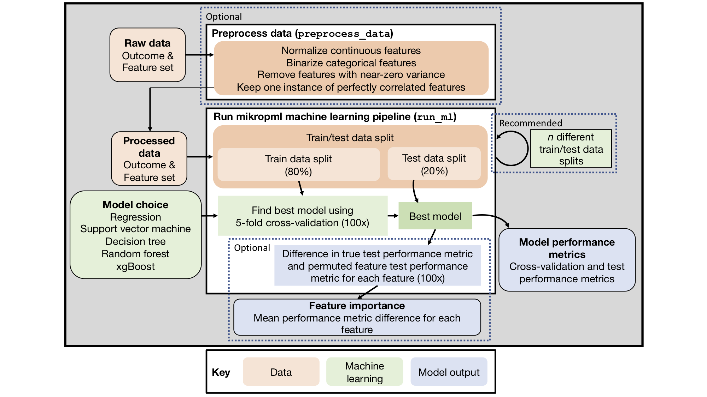

# Summary
Machine learning (ML) is a useful tool that researchers from diverse fields can use to investigate various probelms and questions related to classifying samples into groups. However, implementing a robust ML pipeline can be time-consuming, confusing, and difficult. Here, we presente mikRopML, an easy-to-use R package that acts as a wrapper around the R caret package and can be used for binary classification problems using logistic regression, random forest, and xgBoost. mikRopML is available on [GitHub/CRAN] (link). 

# Statement of need

Machine learning (ML) is widely used to analyze large datasets from fields ranging from biology to gender studies. Several packages including `caret` in R [@kuhn_building_2008] and `scikitlearn` in Python [@pedregosa_scikit-learn_2011] allow you to implement your own ML algorithms; however, creating a robust machine learning pipeline can be overwhelming, particularly for beginners. ML requires data pre-processing, cross-validation, testing, model evaluation, and often interpretation of important features. Performing these steps using the correct methodology is extremely important as failure to implement a robust ML pipeline can result in incorrect and misleading results [@teschendorff_avoiding_2019]. To make performing robust ML analyses easily accessible to a broader set of researchers, we created mikRopML (**[insert path to GitHub or CRAN]**), an easy-to-use package in R [CITE] that implements the Topcuoglu et al [@topcuoglu_framework_2020] ML framework for binary classification problems using logistic regression [@paul_liblinear_2017], random forest [@liaw_classication_2002], or xgBoost [@chen_xgboost_2020]. Furthermore, we provide a data pre-processing function based on the FIDDLE framework outlined in Tang et al. [@tang_fiddle_2020].

While Topcuoglu et al [@topcuoglu_framework_2020] focused specifically on ML for microbiome data, the framework is generalizable to performing ML on other types of data as well. For instance, we have used the mikRopML framework to identify differences in genomic and clinical features associated with infection and colonization of a bacterial pathogen [@lapp_machine_2020]. Furthermore, we used the same framework to study gender representation and bias in journal articles [**cite Ada’s paper**]. Thus, this package can be used to study questions as diverse as what gut bacteria are associated with cancer to whether there are differences in authorship gender representation in journal articles.

# mikRopML package

mikRopML has one main wrapper function called `run_ml` that minimally takes in a data frame including a binary outcome and features, and model choice (logistic regression [@paul_liblinear_2017], random forest [@liaw_classication_2002], or xgBoost [@chen_xgboost_2020]). It trains and tests the data using the `caret` R package [@kuhn_building_2008], evaluates the model using the `PRROC` R package [@grau_prroc_2015], and optionally quantifies feature importance. The output includes the best model, two model evaluation metrics (AUROC and AUPRC), and optional feature importances (Figure 1). Feature importance allows the users to more easily identify features that have a large impact on model performance, and is thus particularly useful for model interpretation [@topcuoglu_framework_2020]. Our vignette [link to vignette] contains a comprehensive tutorial on how to use mikRopML.
<!--TODO Add in more details about visualization (here and/or in snakemake pipeline) -->

We also provide a function that pre-processes features (`preprocess_data`) using several different functions from the `caret` package. The `preprocess_data` function takes continuous and categorical data, re-factors categorical data into binary features, and provides options to normalize continuous data, remove features with near-zero variance, and remove correlated features. We chose the default options based on those implemented in FIDDLE [@tang_fiddle_2020], and we direct users to this paper for more information on data pre-processing prior to ML.

mikRopML is written in R [@r_core_team_r_2020] and depends on several packages: PRROC [@grau_prroc_2015], dplyr [@wickham_dplyr_2020], caret [@kuhn_building_2008], LiblineaR [@paul_liblinear_2017], rlang [@henry_rlang_2020]. Packages that our package suggests are: testthat [@wickham_testthat_2011], knitr [@xie_dynamic_2015; @xie__aut_knitr_2020], rmarkdown [@allaire_rmarkdown_2020; @xie_r_2018], future.apply [@bengtsson_futureapply_2020], randomForest [@liaw_classication_2002], kernlab [@karatzoglou_kernlab_2004], rpart [@therneau_rpart_2019], xgboost [@chen_xgboost_2020], doParallel [@ooi_doparallel_2019], foreach [@ooi_foreach_2020].

# Snakemake pipeline to run mikRopML with multiple train/test splits

In addition to simply performing ML on a single train/test split, we have found that it is important to investigate how model performance differs depending on the train and test set used [@topcuoglu_framework_2020; @lapp_machine_2020]. Therefore, we provide an example of how to integrate mikRopML into a snakemake workflow [link to snakemake workflow example] that runs machine learning 100 times and outputs summary information about model and feature importance.

# Acknowledgements
We'd like to thank members of the Schloss Lab who participated in code clubs related to the initial development of the pipeline. 
# Funding
<!--TODO Kelly and others add funding -->
ZL received support from the National Science Foundation Graduate Research Fellowship Program under Grant No. DGE 1256260. Any opinions, findings, and conclusions or recommendations expressed in this material are those of the authors and do not necessarily reflect the views of the National Science Foundation.

# Author contributions
BT, ZL, and KS conceptualized the study and created the package. BT, ZL, JW, and PS developed methodology. PS and JW supervised the project. BT, ZL, and KS wrote the original draft. All authors reviewed and edited the manuscript.

# Conflicts of interest
<!--TODO Add conflicts of interest here -->

# References
